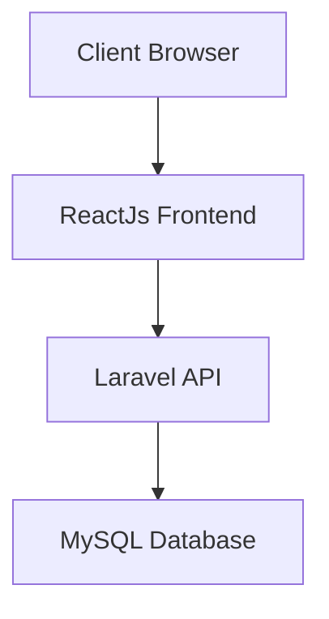

# 🎓 Hệ Thống Quản Lý Học Tập

<div align="center">


**Một hệ thống quản lý học tập hiện đại dành cho giảng viên và sinh viên**

[Demo](#demo) • [Tính năng](#-tính-năng) • [Cài đặt](#-cài-đặt) • [Hướng dẫn](#-hướng-dẫn-sử-dụng) • [Đóng góp](#-đóng-góp)

</div>

---

## 📋 Mô tả dự án

Trong bối cảnh **chuyển đổi số trong giáo dục** ngày càng phát triển, việc ứng dụng công nghệ vào quản lý học tập trở thành xu hướng tất yếu. Giảng viên hiện nay không chỉ đảm nhận vai trò giảng dạy mà còn phải thực hiện nhiều công việc quản lý phức tạp như:

- 📊 Cập nhật và quản lý điểm số
- 📈 Thống kê và phân tích kết quả học tập  
- 📢 Gửi thông báo và tương tác với sinh viên
- 📋 Theo dõi tiến độ học tập cá nhân
- 📄 Tạo báo cáo tổng hợp theo lớp học

**Hệ thống Quản lý Học tập** được phát triển để giải quyết những thách thức này, cung cấp một nền tảng tích hợp hoàn chỉnh giúp tối ưu hóa quy trình quản lý giáo dục.

## ✨ Tính năng chính

### 👨‍🏫 Dành cho Giảng viên
- **🎯 Quản lý lớp học**: Tạo, chỉnh sửa và theo dõi các lớp học
- **📝 Nhập điểm linh hoạt**: Hỗ trợ nhiều loại bài kiểm tra và thang điểm
- **📊 Dashboard thống kê**: Biểu đồ trực quan về kết quả học tập
- **📱 Gửi thông báo**: Thông báo realtime cho sinh viên
- **📄 Báo cáo tự động**: Xuất báo cáo Excel/PDF chi tiết

### 👨‍🎓 Dành cho Sinh viên  
- **📚 Xem điểm số**: Theo dõi kết quả học tập realtime
- **📅 Lịch học**: Quản lý thời khóa biểu cá nhân
- **💬 Tương tác**: Nhận thông báo và phản hồi từ giảng viên
- **📈 Theo dõi tiến độ**: Biểu đồ phát triển học tập cá nhân

## 🛠️ Công nghệ sử dụng

### Backend
- **🔧 Framework**: Laravel 12.x
- **🗄️ Database**: MySQL 8.0
- **🔐 Authentication**: JWT
- **📧 Notification**: Firebase Cloud Messing

### Frontend  
- **⚡ Framework**: React.js 
- **🚀 Build Tool**: Vite

### DevOps & Tools
- **🐳 Containerization**: Docker + Docker Compose
- **🔄 CI/CD**: GitHub Actions
- **📝 Code Quality**: PHP CS Fixer, ESLint
- **🧪 Testing**: PHPUnit, Cypress

## 🚀 Cài đặt

### Yêu cầu hệ thống
- PHP >= 8.2
- Node.js >= 22.x
- MySQL >= 8.0
- Composer >= 2.0

### Cài đặt bằng Docker (Khuyến nghị)

```bash
# Clone repository
git clone https://github.com/hoang192k4/learning-management-system.git
cd learning-management-system

# Chạy với Docker
docker-compose up -d

# Cài đặt dependencies
docker-compose exec app composer install
docker-compose exec app npm install

# Cấu hình environment
cp .env.example .env
docker-compose exec app php artisan key:generate

# Migrate database
docker-compose exec app php artisan migrate --seed
```

### Cài đặt thủ công

```bash
# Backend setup
composer install
cp .env.example .env
php artisan key:generate
php artisan migrate --seed
php artisan serve

# Frontend setup (terminal mới)
cd frontend
npm install
npm run dev
```

## 📖 Hướng dẫn sử dụng

### Tài khoản mặc định
```
Giảng viên:
📧 Email: teacher@example.com
🔑 Password: password123

Sinh viên:
📧 Email: student@example.com  
🔑 Password: password123
```

### API Documentation
Tài liệu API chi tiết có tại: `http://localhost:8000/api/documentation`

## 📸 Screenshots

<div align="center">

### Dashboard Giảng viên


### Quản lý điểm số


### Giao diện Sinh viên


</div>

## 🏗️ Kiến trúc hệ thống



## 🧪 Testing

```bash
# Backend tests
php artisan test

# Frontend tests  
npm run test

# E2E tests
npm run cypress:run
```

## 📊 Performance

- ⚡ **Load time**: < 2s
- 📱 **Mobile responsive**: 100%
- 🔍 **SEO Score**: 95/100
- ♿ **Accessibility**: WCAG 2.1 AA

## 🤝 Đóng góp

Chúng tôi hoan nghênh mọi đóng góp! Vui lòng đọc [CONTRIBUTING.md](CONTRIBUTING.md) để biết thêm chi tiết.

### Quy trình đóng góp
1. 🍴 Fork repository
2. 🌿 Tạo feature branch (`git checkout -b feature/amazing-feature`)
3. 💾 Commit changes (`git commit -m 'Add amazing feature'`)
4. 📤 Push to branch (`git push origin feature/amazing-feature`)  
5. 🔄 Tạo Pull Request

## 👥 Nhóm phát triển

<div align="center">

|  |  |
|:---:|:---:|
| **Đặng Khánh Đông** | **Nguyễn Ngọc Hoàng** |
| Developer | Developer |
| [](https://github.com/dongkhanh) | [](https://github.com/hoang192k4) |

</div>

## 📝 License

Dự án này được phân phối dưới giấy phép MIT. Xem [LICENSE](LICENSE) để biết thêm thông tin.

## 📞 Liên hệ

- 📧 Email: conankun170606@gmail.com
- 🌐 Website: [donghoang.online](https://donghoang.online)
- 📱 Discord: 

---

<div align="center">

**⭐ Nếu dự án hữu ích, hãy cho chúng tôi một ngôi sao! ⭐**

Made with ❤️ by Khánh Đông - Ngọc Hoàng 
</div>
